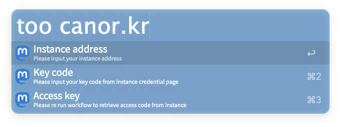
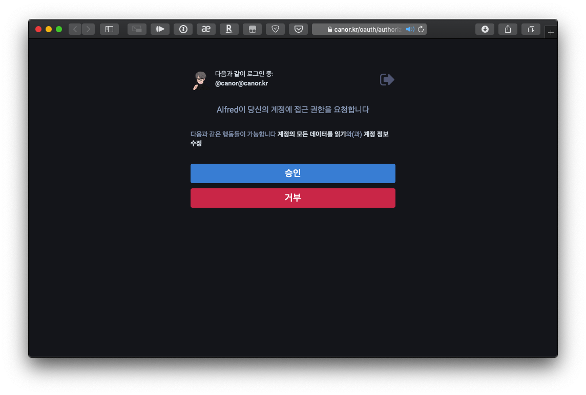
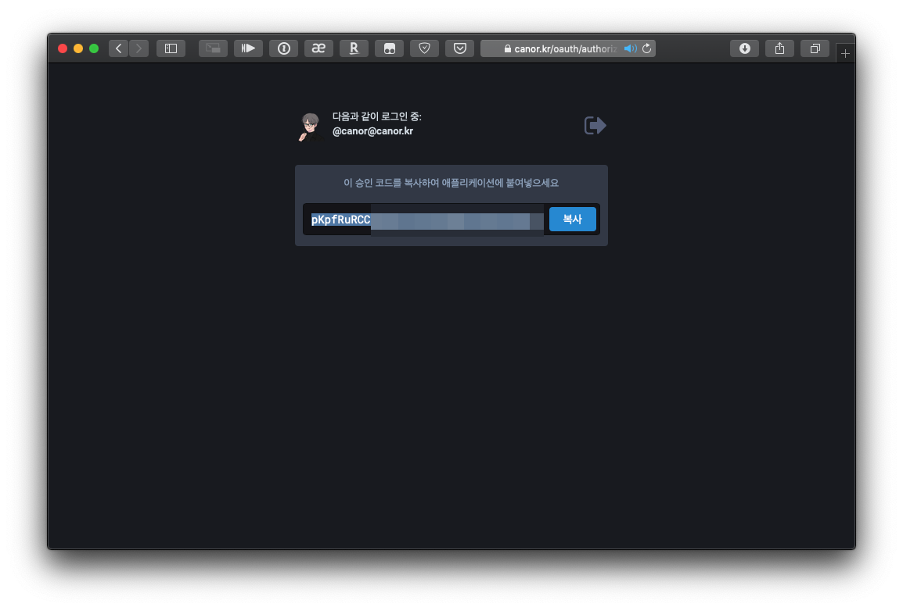
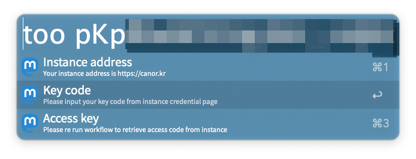
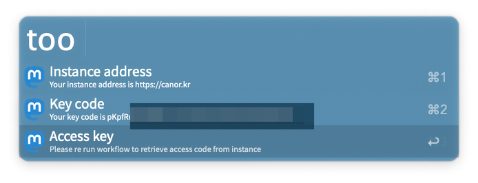
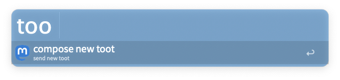
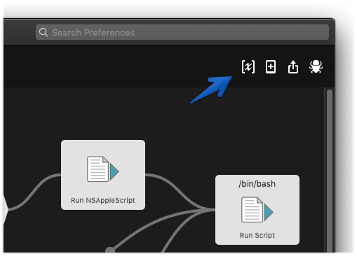
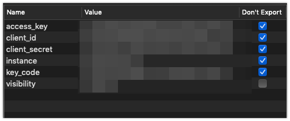

# Alfred-toot

alfred 워크플로우에서 툿을 발송하는 워크플로우입니다.

기본적으로 툿을 발송하는 데에 초점이 맞추어져 있고 타임라인을 읽는 데에는 적합하지 않습니다. [tootstream](https://github.com/magicalraccoon/tootstream) 과 같은 별도의 타임라인 툴과 함께 사용하시는 것을 권장합니다.

## 필수 목록

- python3
- Alfred 3 유료 버전 (무료 버전은 커스텀 워크플로우를 지원하지 않습니다.)
- Requests, Pillow 패키지

## 인증

### 인스턴스 주소 지정

`too` 키워드를 입력하고 인스턴스를 지정합니다.

인스턴스를 입력하고 엔터를 누르면 인스턴스의 인증 페이지가 열립니다. 로그인 상태면 인증버튼만 누르면 되고 로그인이 되어 있지 않으면 로그인해서 인증을 해줍니다.

### 인증코드 입력

인증을 하면 코드를 줍니다. 이 코드를 복사합니다. 아직 창 닫지 마세요.

`too` 키워드로 다시 워크플로우를 불러내서 인증코드를 입력하고 key code 항목을 선택해줍니다. 인스턴스 입력이 올바르게 되었는지 확인할 수 있습니다.(instance address 항목 아래 작은 글자)

### 워크플로우 재실행

`too` 키워드로 인스턴스 주소와 인증코드가 모두 올바로 입력되었는지 확인하고 Access Key 항목을 눌러 인증키를 발급받습니다.

인증 절차가 완료되면 `too` 키워드를 호출해도 인증 항목이 나타나지 않습니다.

### 입력내용을 틀렸다면

Alfred 워크플로우 항목에 들어가보면 우상단에 [x] 아이콘이 있습니다.

잘못 입력한 설정값을 더블클릭하여 설정값을 바꿔줍니다.

## 사용

### 기본 툿 작성

1. 툿 작성 키워드를 입력하고 그 뒤에 툿 내용을 입력합니다. 기본 키워드는 `toot` 입니다.
2. 또는 키보드 단축키로 입력창을 불러냅니다. 기본 키보드 단축키는 `ctrl + option + d` 입니다.

툿 내용은 반드시 가장 앞에 와야 합니다.

### 공개범위

`!visib: ` 뒤에 공개 범위를 입력합니다. `public`, `unlisted`, `private` 을 지원합니다.

### 내용 가리기

`!cw: ` 뒤에 경고문구를 입력합니다.

### 클립보드 이미지

`!cb:` 를 붙여 클립보드에 있는 이미지를 첨부할 수 있습니다. 별도의 값을 받지 않습니다.  `Pillow` 패키지가 필요합니다.

### 이전 툿에 이어서 툿하기

`!prev:` 인자를 붙여 사용할 수 있습니다. 별도의 값을 받지 않습니다.

### 웹 링크 첨부하기

`!web:` 인자를 붙여 사용할 수 있습니다. 별도의 값을 받지 않고 **Safari에서만 동작합니다.**

(Safari 이외에 FireFox 같은 경우는 애플스크립트 API를 지원하지 않아서 실질적으로 웹페이지 링크를 불러올 방법이 없어서 그렇습니다.. 크롬은..)

### 회신하기

`mreply` 키워드를 입력한 뒤에 답장할 내용을 입력하고 어느 툿에 회신할 것인지 선택합니다. 워크플로우가 입력 내용을 처리하는데 1초 가량의 시간이 필요합니다. 

(처리가 끝나기 전에 발송할 경우 뒤의 내용이 잘린 채로 발송되는 불상사가 발생할 수 있습니다.. 우회방법을 찾는 중입니다..)

### 부스트하기

`rt` 키워드를 입력하고 나오는 내용 중 선택하여 부스트합니다. 홈 타임라인 기준 최근 40개까지 보여집니다.

### 즐겨찾기

`fv` 키워드를 입력하고 나오는 내용 중 선택하여 부스트합니다. 홈 타임라인 기준 최근 40개까지 보여집니다.